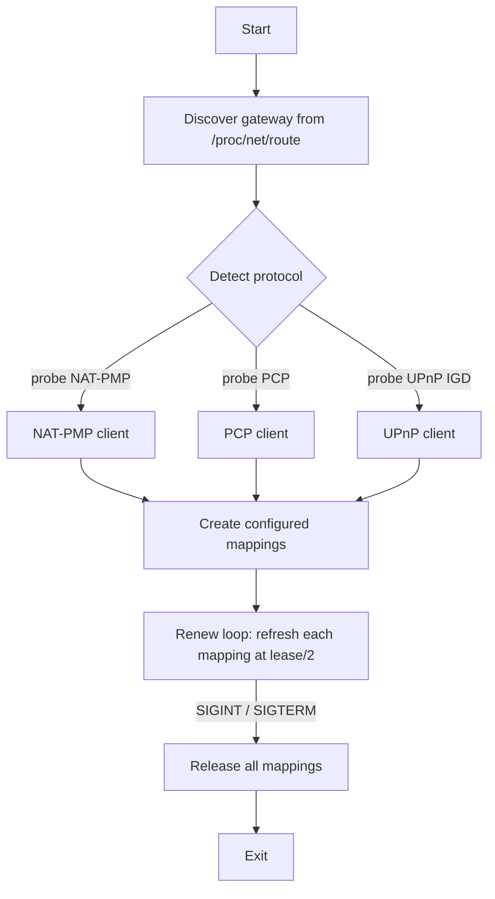

# nat-pmp

A small Linux daemon that automatically requests and maintains port forwardings
on your home router. It reads a list of desired mappings from a YAML file, asks
the router to create them, renews each mapping before its lease expires, and
releases them cleanly on shutdown.

The router protocol is auto-detected: the daemon supports **UPnP IGD**,
**NAT-PMP** (RFC 6886), and **PCP** (RFC 6887), and uses the first one the router
answers. All three protocol clients are implemented directly on the Go standard
library.

## Features

- Auto-detects the router's port-mapping protocol (NAT-PMP, PCP, or UPnP IGD).
- Maintains persistent forwardings by renewing each mapping at half its granted
  lease lifetime.
- Releases all mappings on `SIGINT`/`SIGTERM` for a clean shutdown.
- Re-creates mappings automatically if the router reboots and loses state.
- Optionally gates a mapping on a local listener: with `require_listener`, the
  forwarding is only opened while a socket is bound to the internal port and is
  released when the listener goes away.
- Reports the external IP and the actual external port the router assigned
  (which may differ from the requested port).
- Configured entirely from a YAML file, with environment-variable overrides.

## Requirements

- Linux (the default gateway is discovered from `/proc/net/route`).
- A router that speaks at least one of UPnP IGD, NAT-PMP, or PCP.

## Usage

```
nat-pmp --config config.yaml
```

| Flag              | Default       | Description                          |
| ----------------- | ------------- | ------------------------------------ |
| `-c`, `--config`  | `config.yaml` | Path to the YAML configuration file. |

The process runs in the foreground and logs its activity. Press `Ctrl-C` (or
send `SIGTERM`) to stop it; it will release all active mappings before exiting.

## Configuration

Mappings are declared in a YAML file. Each mapping is a single port; to forward
several ports, list several mappings.

```yaml
log_level: info          # debug | info | warn | error (default: info)

internal_address: 192.168.1.50  # default LAN address mappings forward to
                                # (omit to auto-derive from the route)

detect:
  order: [natpmp, pcp, upnp]  # optional probe order override
  timeout: 3s                 # per-protocol detection timeout (default: 3s)

mappings:
  - protocol: tcp        # tcp | udp | both
    internal_port: 22000 # port on this host (required, non-zero)
    external_port: 22000 # WAN-side port; omit or 0 to let the router choose
    description: syncthing
    lease: 1h            # requested lifetime (default: 1h)
    internal_address: 192.168.2.10  # override the default for this mapping

  - protocol: udp
    internal_port: 51820
    # external_port omitted -> router assigns one
    description: wireguard
    require_listener: true  # only forward while a socket is bound to 51820

  - protocol: both       # forwards the port over both TCP and UDP
    internal_port: 3478
    external_port: 3478
    description: turn

  - protocol: tcp
    internal_port: 25565
    external_port: 25565
    description: minecraft-java
    require_listener: true  # only forward while the server is running

  - protocol: udp
    internal_port: 19132
    external_port: 19132
    description: minecraft-bedrock
    require_listener: true  # only forward while the server is running
```

Use `protocol: both` to forward a port over TCP and UDP at once. It is a
convenience that the daemon expands into separate TCP and UDP mappings, since
the underlying protocols map one transport per request.

### Configuration reference

| Field                    | Type     | Default | Description                                                        |
| ------------------------ | -------- | ------- | ------------------------------------------------------------------ |
| `log_level`              | string   | `info`  | Log verbosity: `debug`, `info`, `warn`, or `error`.                |
| `internal_address`       | string   | (auto)  | Default LAN address mappings forward to. Empty auto-derives it from the route to the gateway. Must be bound to a local interface. |
| `detect.order`           | list     | (auto)  | Protocol probe order. Valid: `natpmp`, `pcp`, `upnp`.              |
| `detect.timeout`         | duration | `3s`    | Time budget for each protocol probe during detection.              |
| `mappings[].protocol`    | string   | —       | Transport protocol: `tcp`, `udp`, or `both` (forwards over TCP and UDP). |
| `mappings[].internal_port` | uint16 | —       | Local port that traffic is forwarded to. Must be non-zero.         |
| `mappings[].internal_address` | string | (default) | LAN address this mapping forwards to. Overrides the top-level `internal_address`. Must be bound to a local interface. |
| `mappings[].external_port` | uint16 | `0`     | Requested WAN-side port. `0` lets the router choose a port.        |
| `mappings[].description` | string   | `""`    | Human-readable label for the mapping.                              |
| `mappings[].lease`       | duration | `1h`    | Requested mapping lifetime.                                        |
| `mappings[].require_listener` | bool | `false` | Only open the mapping while a local listener is bound to the internal port; release it when the listener disappears. |

### Environment overrides

Any field can be overridden via environment variables prefixed with `NATPMP_`.
For example, `NATPMP_LOG_LEVEL=debug` overrides `log_level`.

### Validation

The configuration is rejected at startup if it declares no mappings, uses a
protocol other than `tcp`/`udp`/`both`, uses an invalid detection protocol or log
level, has a zero internal port, sets an internal address that does not parse or
is not bound to any local interface, has a negative lease, defines two mappings
with the same protocol and internal port, or defines two mappings with the same
protocol and non-zero external port. Leases must be whole-second durations no
larger than the protocol maximum. A `both` mapping is checked against both its
TCP and UDP forms.

## How it works

On startup the daemon discovers the gateway, detects the protocol, creates the
configured mappings, and then keeps them alive until it is asked to stop.



- **Discovery** finds the default gateway (needed by NAT-PMP and PCP; UPnP finds
  the gateway itself via SSDP multicast).
- **Detection** probes each protocol in order and selects the first that
  responds. NAT-PMP and PCP are tried before UPnP because they fail fast.
- **Renewal** refreshes each mapping halfway through the lifetime the router
  actually granted. If a renewal fails (for example, because the router
  rebooted), the mapping is re-created.
- **Shutdown** releases every active mapping on a best-effort basis.

### Listener gating

A mapping with `require_listener: true` is only opened while a local socket is
bound to its internal port. The daemon determines this by reading
`/proc/net/tcp`, `/proc/net/tcp6`, `/proc/net/udp`, and `/proc/net/udp6`: a TCP
mapping requires a socket in the `LISTEN` state, and a UDP mapping requires any
socket bound to the port. While no listener is present the mapping is not
created and is re-checked every 15 seconds, so the forwarding opens promptly
once a listener appears. If the listener later disappears, the mapping is
released. When the listener check itself fails (for example, a `/proc` read
error), the daemon conservatively assumes a listener is present so a transient
failure does not tear down a working forwarding.

### Multi-homed hosts

On a host with several IP addresses or interfaces, `internal_address` selects
which LAN address a forwarding targets. It can be set once at the top level as
the default for every mapping, and overridden per mapping. When it is omitted,
the daemon derives the address from the route to the gateway, preserving the
previous behavior.

The address is honored across all three protocols, though the mechanism differs:

- **UPnP IGD** sends the address explicitly as `NewInternalClient`.
- **NAT-PMP** and **PCP** bind the request socket to the address, so the gateway
  maps to that source IP; PCP also carries it as the client address in the
  request header.

The address must be bound to one of the host's interfaces, which is verified at
startup.

## Protocols

| Protocol | Reference | Transport            | Notes                                             |
| -------- | --------- | -------------------- | ------------------------------------------------- |
| NAT-PMP  | RFC 6886  | UDP to gateway:5351  | IPv4 only.                                         |
| PCP      | RFC 6887  | UDP to gateway:5351  | Uses IPv4-mapped IPv6 addresses on the wire.       |
| UPnP IGD | UPnP spec | SSDP + HTTP/SOAP     | Prefers `WANIPConnection:2`, falls back to `:1`.  |

## License

See the repository for license details.
